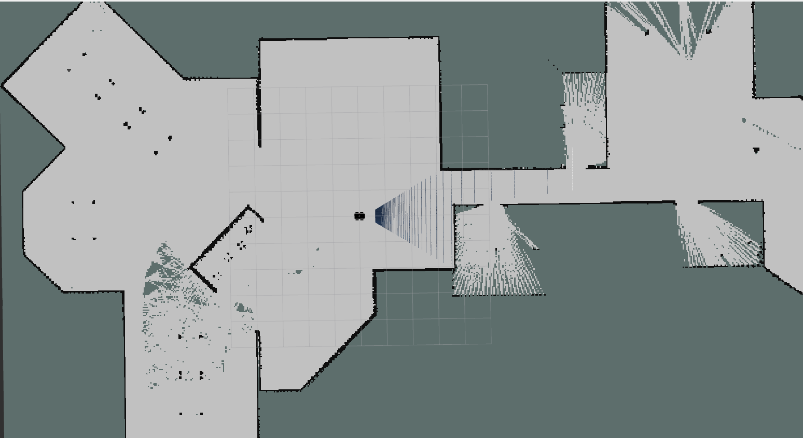
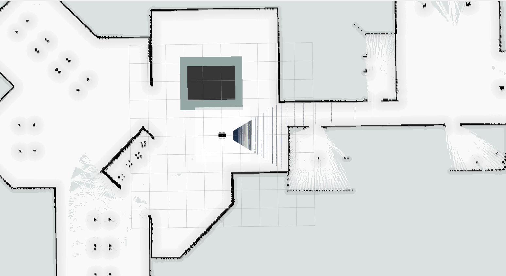

# SVTRP Fase 0

This repository includes the simulations made for the SVTRP CTEx Fase 0 for testing purposes. The main goal was developing an autonomous surveillance system. It includes indoor and outdoor navigation applications besides some Computer Visual features.

---
### System Especifications
- Ubuntu 22.04
- Python 3.10
- ROS Humble
- Gazebo Classic 11

## Usage
Let's break down in three main areas: indoor navigation, outdoor navigation, Computer Vision and Other Features.

### Indoor Navigation
To launch the simulation run:

     ros2 launch robot_gazebo main_indoor.launch.py

This command will: 
- start gazebo classic with the custom world;
- run the robot_description package;
- spawn the robot in gazebo;
- start the diff driver and joint broadcaster controllers; and
- launch the robot localization package already configured for the application. 

For SLAM it's used the slam_toolbox (https://github.com/SteveMacenski/slam_toolbox). To launch the slam in the predefined world you need to change the absolute path to the map file in the slam/config/mapper_params.yaml file and then run:

     ros2 launch slam online_async_launch.py

This runs with an already made map of the environment, so it runs in localization mode. If you want to build a map in a new world you need to change the mode from localization to mapping in the following line of the mapper_params.yaml file:

    mode: localization # mapping

You will have the following result:

The navigation package used is the nav2 (https://navigation.ros.org/). In order to run the simple nav2 node you just need to run:

    ros2 launch slam navigation2.launch.py

I also implemented some useful tools available in the nav2 package

#### Keep out filter

I applied a keep out filter in some region such as this one developed in this tutorial: https://navigation.ros.org/tutorials/docs/navigation2_with_keepout_filter.html. It's really usefull but It has a problem, it doesn't create a costmap around the region, so in many attempts the path will be too much closer to the region and the robot will be stucked. To solve this problem I will create a mask around this region, but unfortunately I didn't have time to do so yet.

But for now, when you launch with this filter with:

    ros2 launch slam navigation2_filtered.launch.py

You will have something like that:

There are more modifications that I tested and you can dive in the slam package.

### Outdoor Navigation

To launch this simulation you can run:

    ros2 launch robot_gazebo main_indoor.launch.py

This command will launch the nodes such as the indoor navigation, but configured to the outdoor environment. The main changes here are the world and the localization configuration file, because now the robot uses the gps to build a the transformation between the map and the odometry frame.

Everything that is developed in this part is based on this very good documentation provided by nav2: (https://navigation.ros.org/tutorials/docs/navigation2_with_gps.html. So you can follow this tutorial to fully understand this package. It's worth to mention that the navigation controller was changed from DWB to Regulated Pure Pursuit, in order to increase the robot speed.

### Computer Vision

In this part I have two separate packages: ball_tracker and yolo. The first one is based on this repository https://github.com/joshnewans/ball_tracker and, as the name points out, is responsible for tracking and following an object. The second is merely the using of Yolo V8 in ROS2.

## Put some images here

### Other Features

In this part there are some other features developed in this context in order to help the surveillance activities.

#### Randon Navigation

It has been created a simple c++ program that send go to pose commands randomly based on the poses stored on the *poses.txt* file. You would need to pass these poses to the file manually, but once it was done, the robot can navigate through them in a way that the next pose is not predefined, something important in a surveillance system. 

To run this you need to launch the simulation and the slam launch file and them:

     ros2 run nav2_features go_to_pose

